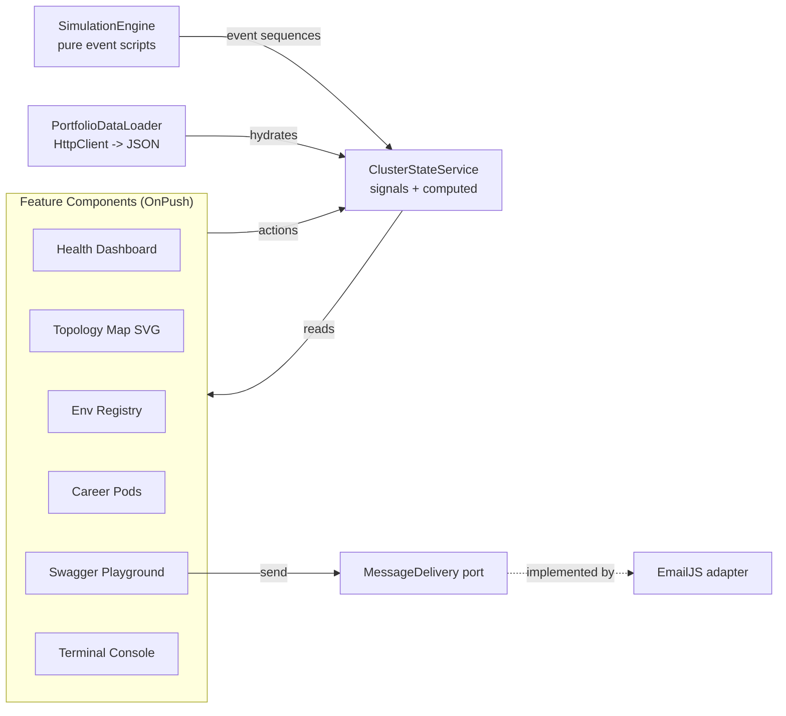

# Architecture Spine — Actuator Portfolio

## Design Paradigm

**Unidirectional data flow with a single signals store; ports & adapters at every external seam.**

All mutable simulation state lives in one injectable store (`ClusterStateService`) exposing Angular signals. Components read via `computed()` and mutate only by calling store methods. External interactions (contact delivery) cross a port interface with injectable adapters. The dashboard shell is one page; "tabs" are signal-selected panels.



## Invariants & Rules

### AD-1 — Single signals store for all simulation state

- **Binds:** all components (FR-1, FR-2, FR-4, FR-5); Terminal Console; Topology Map
- **Prevents:** per-component copies of outage/health state drifting out of sync across panels during a simulated outage
- **Rule:** all shared state (`status`, `errorRate`, `logs[]`, selected node/pod/tab) lives in `ClusterStateService` as signals; components read via `computed()` and change state only through store methods. No NgRx, no RxJS subjects as stores, no component-local duplicates of shared state. `[ADOPTED]`

### AD-2 — No router

- **Binds:** app shell / navigation
- **Prevents:** GitHub Pages path-routing refresh breakage and router bundle overhead on a single-screen dashboard
- **Rule:** tabs are a `selectedTab` signal in the store; no Angular Router import anywhere in the app. Deep links are a non-goal. `[ADOPTED]`

### AD-3 — Content lives in runtime-fetched JSON

- **Binds:** FR-7 (projects, experience, contact details, env properties)
- **Prevents:** portfolio content hardcoding into components/logic
- **Rule:** all portfolio content is served from `public/portfolio-data.json` (under assets), fetched once at startup via `HttpClient` and validated against a TypeScript interface before entering state. Components render only typed shapes; they never fetch content themselves. Revisit condition: migrate to build-time typed TS module once content stabilizes. `[ADOPTED]`

### AD-4 — Contact delivery behind a port

- **Binds:** FR-6, SM-1
- **Prevents:** EmailJS SDK types/calls leaking into UI components; vendor lock-in
- **Rule:** the Swagger Playground depends only on the `MessageDelivery` port interface (`send(payload): Promise<DeliveryReceipt>`). EmailJS is one DI-provided adapter. Swapping vendors = writing one new adapter + changing one provider token; no component changes. `[ADOPTED]`

### AD-5 — Topology map is hand-authored SVG

- **Binds:** FR-3
- **Prevents:** heavyweight graph-library dependencies for a fixed 5-node diagram
- **Rule:** the topology renders as inline SVG elements in an Angular template; node/edge states (highlighted, degraded-red) are class/style bindings to store state. No D3/Cytoscape/graph library. `[ADOPTED]`

### AD-6 — Design tokens own the theme vocabulary

- **Binds:** all styling across every component
- **Prevents:** hardcoded colors/fonts per component diverging from the actuator theme
- **Rule:** status palette (`up` green, `degraded` red, info blue), monospace stack, and spacing are CSS custom properties defined in one global stylesheet; components reference tokens, never raw values (SVG stroke/fill attributes included). Hand-rolled CSS only — no Tailwind, no component library. `[ADOPTED]`

### AD-7 — Deploy via GitHub Actions to Pages

- **Binds:** SM-3, deployment
- **Prevents:** committed build artifacts and manual deploy drift; broken asset paths under the project-page subpath
- **Rule:** push to `main` triggers a workflow that runs `ng build --configuration production` with base-href set to `/<repo>/`, uploads the artifact, and deploys to Pages. All asset references must be base-href-safe (relative or Angular-processed). No build output is ever committed. `[ADOPTED]`

### AD-8 — Angular v22 idiom baseline

- **Binds:** all code
- **Prevents:** legacy idiom mixing (NgModules, decorators-based control flow, zone assumptions)
- **Rule:** standalone components, signals-first, OnPush change detection, built-in control flow (`@if/@for`), strict TypeScript. `[ADOPTED]`

### AD-9 — Testing: Vitest unit tests on the state core

- **Binds:** quality enforcement
- **Prevents:** untested outage/recovery transitions regressing silently
- **Rule:** unit tests run via `ng test` (Vitest); `ClusterStateService` transitions (UP → DEGRADED → HALF-OPEN → UP), log sequencing, and the `MessageDelivery` port (mocked adapter) are covered. E2E deferred. `[ADOPTED]`

### AD-10 — SimulationEngine is the single writer of outage state

- **Binds:** FR-1, FR-2; SimulationEngine ↔ ClusterStateService seam
- **Prevents:** two compliant write paths — user-driven direct store mutations racing engine-timed auto-sequences — disagreeing on who initiates transitions (e.g. HALF-OPEN)
- **Rule:** every cluster-state transition originates in the `SimulationEngine`. UI controls ("Simulate Outage", "Trigger Auto-Recovery") only invoke engine commands; the engine emits the full scripted sequence (including HALF-OPEN and recovery) into the store. Components never write outage status directly.

### AD-11 — External seams carry typed, code-owned contracts

- **Binds:** FR-6, FR-7; port and data-loader seams
- **Prevents:** each feature improvising its own payload/receipt/error shapes at the same seams
- **Rule:** the `MessageDelivery` port defines its own payload and `DeliveryReceipt` types (including the Kafka-style receipt fields the Swagger UI displays) and returns failures as typed results, never thrown SDK errors. Content interfaces (`LogEntry`, portfolio content shapes) live in `src/app/core/data` and are the canonical definitions imported everywhere.

## Consistency Conventions

| Concern | Convention |
| --- | --- |
| Naming | Services: `*.service.ts`; ports: `*.port.ts`; adapters: `<vendor>.adapter.ts`; components: `<feature>.component.ts`; mock services named after real ones (`payment-service`, `api-gateway`, …) |
| State mutation | Only via `ClusterStateService` methods (outage transitions only via `SimulationEngine`, AD-10); signals are exposed read-only to components; derived views (degraded nodes, filtered metrics) are computed selectors in the store — the store holds raw status, not pre-derived arrays |
| Logs | Structured log entries `{ timestamp, source, level, message }`; console capped at last 200 entries |
| Simulation events | Scripted sequences emitted by the pure `SimulationEngine`; no timers inside components |
| Formats | Mock metrics as plain numbers/strings from the JSON catalog; dates ISO `yyyy-MM-dd` |
| Startup & failure | Portfolio JSON is fetched once at bootstrap; on fetch/parse failure the shell renders a themed "SERVICE UNAVAILABLE" panel with retry — never a blank page or console-only error |
| Secrets | The EmailJS public key ships in the static bundle by design (unavoidable for static hosting); acceptable because it is a public-facing key backed by a free-tier quota — no other secrets may ever be placed in the bundle |

## Stack

| Name | Version |
| --- | --- |
| Angular (CLI + core) | ^22.1 |
| TypeScript | ~6.0 |
| Node.js | ^22 \|\| ^24 \|\| ^26 |
| Builder | @angular/build (esbuild) |
| Test runner | Vitest (via `ng test`) |
| Contact vendor | EmailJS (behind AD-4 port) |
| Hosting | GitHub Pages via GitHub Actions |

## Structural Seed

```text
portfolio/
  public/
    portfolio-data.json      # all editable content (FR-7)
  src/app/
    core/
      state/                 # ClusterStateService (signals store)
      simulation/            # SimulationEngine + scripted outage sequences
      data/                  # PortfolioDataLoader + content interfaces
    delivery/
      message-delivery.port.ts
      emailjs/emailjs.adapter.ts
    features/
      health-dashboard/      # probes, metrics, outage controls
      topology/              # SVG node graph + detail panel
      env-registry/          # searchable property table
      career-pods/           # pod list + replica detail
      swagger-playground/    # mock API client + contact form
      terminal-console/      # fixed log pane
    app.component.*          # dashboard shell + tab switching
  .github/workflows/deploy.yml
```

## Deferred

| Decision | Why it can wait |
| --- | --- |
| E2E testing (Playwright smoke on outage flow) | Post-MVP; unit coverage of state core suffices to ship |
| Migration of content to build-time TS module | Only worthwhile once content stabilizes (AD-3 revisit condition) |
| PWA/offline, analytics, SEO metadata | No requirement pulls them yet; additive later |
| i18n / accessibility audit pass | Single-audience MVP; revisit before wider sharing |
